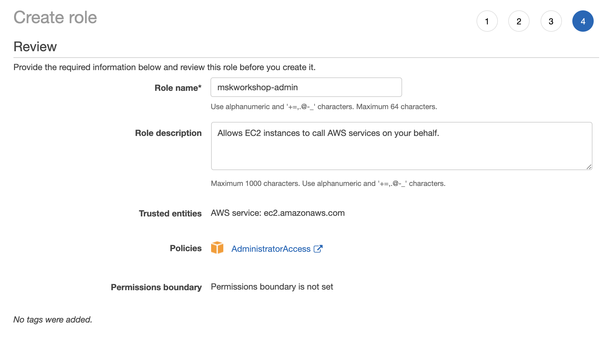

# Visualizing the data in QuickSight

* Amazon QuickSight is a data visualization service you can use to analyze the data that you just combined. For more detailed instructions, see the [Amazon QuickSight User Guide](https://docs.aws.amazon.com/quicksight/latest/user/welcome.html).
* Go to Amazon QuickSight on the AWS Console
* Click **New analysis** on the top right corner
 * **New dataset**
 * **Athena** 
   * Data source name: **NY City Taxi Data**
   * Database: **nycitytaxianalysis**
     * Tables: **canonicaldata01**
	 * **Select**
	 * **Directly query your data**
	   * **Visualize**
* Lets add a calculated field
 * **Add** -> **Add calculated field**
 * Add name: **HourOfDay**
 * Code: **extract('HH',{pickup_date})**
	* **Save**
 * Add Visual **Horizontal bar chart:**
  * Y axis: **HourOfDay**
 * Add Visual **Horizontal bar chart:**
  * Y axis: **type
 * Add Visual **Line Chart**
  * Y axis: **pickup_date(DAY)**
  * color: **type**
  * Filter from the left pane
    * pickup_date
	  * Start date: **First day of the month on your data**
	  * End date: **Last day of the month on your data**

## Summary
 * In the workshop, you went from data investigation to analyzing and visualizing a canonical dataset, without starting a single server. You started by crawling a dataset you didn’t know anything about and the crawler told you the structure, columns, and counts of records.
 * From there, you saw that all three datasets were in different formats, but represented the same thing: NY City Taxi rides. You then converted them into a canonical (or normalized) form that is easily queried through Athena and QuickSight, in addition to a wide number of different tools not covered in this post.

